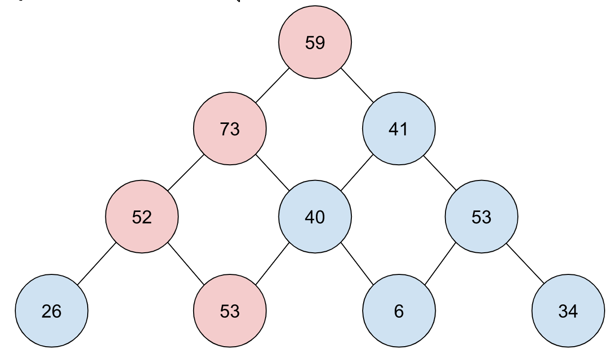

# backend-challenge

## 1. Find the path with the highest value



- Which will be in the following array: `[[59], [73, 41], [52, 40, 53], [26, 53, 6, 34]]`
- The path with the highest value will follow the red points.
- Each node cannot be revisited (must be a one-way path up or down) and must be connected.
- The answer should be in the form of the total sum of the path traversed, which in the example is `237`

Write a program in Go using input from this file `./files/hard.json` and display the calculated result.

### Test case

- input = `[[59], [73, 41], [52, 40, 53], [26, 53, 6, 34]]` output = `237`
- input = `./files/hard.json` output = `7273`

### How to run
```
# ./1-maximum-value-path
go run ./main.go
```

## 2. Catch me if you can, Left-Right-Equals.

Decode the characters according to the example below:

```
The symbol “L” means the left number is greater than the right number.
The symbol “R” means the right number is greater than the left number.
The symbol “=” means the left and right numbers are equal.
Example: The sequence of numbers “410233” can be encoded as “LLRR=”.

Explanation for the sequence “410233”:
The first pair is 4 and 1 → Left (4) is greater than Right (1) → “L”
The next pair is 1 and 0 → Left (1) is greater than Right (0) → “L”
The next pair is 0 and 2 → Left (0) is less than Right (2) → “R”
The next pair is 2 and 3 → Left (2) is less than Right (3) → “R”
The next pair is 3 and 3 → Left (3) is equal to Right (3) → “=”
Thus, “LLRR=” can represent either “410233” or “210122”.

Sum of digits:

For “410233”: 4 + 1 + 0 + 2 + 3 + 3 = 13
For “210122”: 2 + 1 + 0 + 1 + 2 + 2 = 8
The answer is the sequence “210122” because the sum of all digits is the smallest.
```

Write a program in Go to accept an encoded message from the keyboard and convert it into a sequence of numbers that has the smallest sum, displaying that sequence.

### Test case

- input = `LLRR=` output = `210122`
- input = `==RLL` output = `000210`
- input = `=LLRR` output = `221012`
- input = `RRL=R` output = `012001`

### How to run
```
# ./2-encoder
go run ./main.go
```

## 3. Pie Fire Dire  

The problem is to list various types of meat mixed together, such as:

```Fatback t-bone t-bone, pastrami  ..   t-bone.  pork, meatloaf jowl enim.  Bresaola t-bone.```

All words represent names of different types of meat, ignoring commas, periods, or spaces.

Find all the meat names and specify the count of each type of meat.

Use the text from <https://baconipsum.com/api/?type=meat-and-filler&paras=99&format=text>

- Your project must use Go, Go module, and HTTP framework (GRPC is plus)
- You create a JSON API at this endpoint /beef/summary
- The JSON API must count the number of beef
- We encourage you to write tests, which we will give you some extra score
- We will give you an extra score if you focus on performance.

--- sample response --

```json
{
    "beef": {
        "t-bone": 4,
        "fatback": 1,
        "pastrami": 1,
        "pork": 1,
        "meatloaf": 1,
        "jowl": 1,
        "enim": 1,
        "bresaola": 1
    }
}
```

### How to run the servers
```
# ./3-pie-fire-dire/server
go run ./grpcServer

# ./3-pie-fire-dire/client
go run ./fiberServer
```

### How to run the test
```
# ./3-pie-fire-dire/server
go test -v
```
